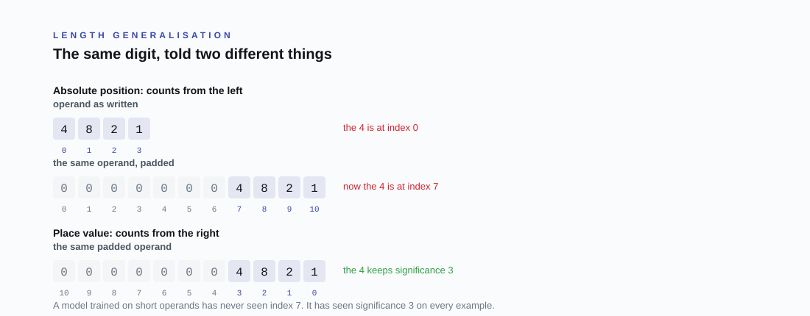
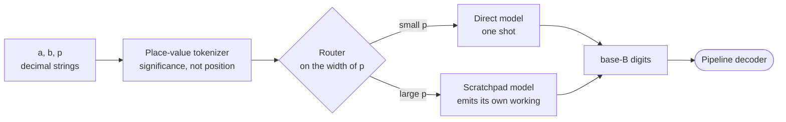

<div align="center">

<br>

# SAIR Modular Arithmetic Challenge

**Can a neural network learn exact arithmetic, rather than approximate it?**

<br>

A research laboratory for one question: given two integers hundreds of digits
long and a prime, can a trained model return `(a × b) mod p` exactly, with no
arithmetic written into the code that runs it?

<br>

[Documentation](docs/README.md) &nbsp;·&nbsp;
[Laboratory](src/README.md) &nbsp;·&nbsp;
[Model](https://huggingface.co/ameythakur/SAIR-Modular-Arithmetic-Challenge) &nbsp;·&nbsp;
[Competition](https://competition.sair.foundation/competitions/modular-arithmetic-challenge/overview) &nbsp;·&nbsp;
[Discussions](https://github.com/Amey-Thakur/SAIR-MODULAR-ARITHMETIC-CHALLENGE/discussions)

<br>

[](https://competition.sair.foundation/competitions/modular-arithmetic-challenge/overview)
[](https://pytorch.org/)
[](https://huggingface.co/ameythakur/SAIR-Modular-Arithmetic-Challenge)
[](https://github.com/Amey-Thakur)
[](https://orcid.org/0000-0001-5644-1575)
[](LICENSE)

<br>



</div>

---

## The problem

Give a calculator two numbers and a prime and it returns the remainder without
thinking. Give the same job to a neural network and it becomes an open
research question.

> Compute `(a × b) mod p`, where `a` and `b` run to about 1,233 decimal digits,
> `p` is prime and up to about 617 digits, and `a` and `b` may be far larger
> than `p`.

Everything arrives as decimal strings. The answer is scored on exact match,
because a remainder that is off by one is simply wrong.

The competition is organised by **Alberto Alfarano**, **François Charton**,
**Yongzheng Jia**, **Kristin Lauter**, **Cathy Li**, **Terence Tao** and
**Emily Wenger**, and ran from 8 June to 12 August 2026.

## Why it is hard

Small transformers can already learn modular *addition* for small primes, and
the representations they find inside look like Fourier analysis on a cyclic
group. Multiplication is a different problem:

- **Carrying** couples digits that are far apart in the input.
- **Coordination** across many digits has to survive at every scale.
- **The output grows with the input**, so nothing about the task is fixed width.
- **Reduction** by `p` then sits on top of all of that.

There is also a structural obstacle that has nothing to do with arithmetic. A
transformer told where a digit sits counts from the left, so padding an
operand moves every digit it has ever seen.

<div align="center">



</div>

A model trained on short operands has never seen index 7. It has seen
significance 3 on every example it was ever given. That single change is why
place-value embeddings generalise to lengths the training set never contained,
and it is the first of the four bets this repository makes.

## What is submitted, and the line that must not be crossed

A submission is a **public Hugging Face repository**, identified by
`repo_id` and an immutable `commit_hash`. Organisers run the official
evaluation against a secret random seed.

The interface is shaped so the obvious cheats are structurally impossible:

| Piece | What it does |
| --- | --- |
| `preprocess_a`, `preprocess_b`, `preprocess_p` | Three separate hooks. Each sees **only its own argument**, so no single point in the submitted code holds `a`, `b` and `p` together |
| `predict_digits` | Returns the answer as base-B digits, most significant first |
| `manifest.json` | Declares the base B: any integer in `[2, 2^32]`, or the string `"p"` |
| The decoder | Belongs to the pipeline, not the contestant. There is no post-processing step to write |

The principle is one sentence: **the model must learn to compute the answer,
and may not delegate, look up, or hard-code it.**

Not allowed at inference time: computing the result with `sympy`, `gmpy2`,
`mpmath`, `flint` or Python big integers on the original arguments; lookup
tables keyed on the inputs or their hashes; `eval`, `exec`, `compile`,
`__import__`, `ctypes`; any network access; reading outside the submission
directory; subprocesses; and any leakage between the three preprocessing
hooks.

Allowed, and worth knowing: base conversion and small-value modular arithmetic
inside a single hook, any internal representation at all, and a loop that
feeds the model its own tokens one at a time, so long as the encoder gets no
feedback from the model about what to feed next.

## The four bets



1. **Abacus significance embeddings.** Drop absolute coordinates and inject
   place value instead, so a digit is described by what it is worth rather
   than where it sits. A 1,024-bit prime then travels the same path as a
   16-bit one.
2. **Algorithmic scratchpads.** Force the model to emit its intermediate
   working, which turns a fixed-depth network into a recurrent state machine
   and lets it spend computation in proportion to the size of the number
   rather than in proportion to its own depth.
3. **Grokking.** Train far past the point where validation loss has flattened,
   with heavy weight decay, so memorised circuits collapse into the sparse
   algorithm underneath. The published weights were taken after that
   transition.
4. **Routing.** Small and large moduli want different amounts of computation,
   so a light router reads the width of `p` and dispatches accordingly.

## The published model

The weights are on the Hugging Face Hub, with a custom `handler.py` so the
Inference API can serve them directly.

**[ameythakur/SAIR-Modular-Arithmetic-Challenge](https://huggingface.co/ameythakur/SAIR-Modular-Arithmetic-Challenge)**
&nbsp;·&nbsp; `.safetensors` &nbsp;·&nbsp; character-level tokenizer
&nbsp;·&nbsp; CC BY 4.0

## What is where

| Path | What it holds |
| --- | --- |
| **[docs/](docs/README.md)** | The reading order: design, competition analysis, literature, open questions |
| **[src/](src/README.md)** | The laboratory: architectures, data generation, training, evaluation, sandbox, export |
| [src/architectures/](src/architectures/) | Abacus and algorithmic models, RoPE and plain baselines, the hybrid router |
| [src/datasets/](src/datasets/) | Prime, curriculum and scratchpad generators, and the [dataset roadmap](src/datasets/dataset_roadmap.md) |
| [src/sandbox/](src/sandbox/) | An AST validator and a judge simulator, so the competition rules are checked before submission |
| [src/huggingface/](src/huggingface/README.md) | Export to `.safetensors`, the inference handler, and the model card |
| [data/](data/) | Sample curriculum and scratchpad shards |
| [.github/](.github/) | The figure generator |

## Run it

The laboratory needs Python 3.10 or newer and PyTorch 2.0 or newer. The
figure generator and the sandbox validator need neither.

```bash
python src/datasets/generators/prime_gen.py
python src/datasets/generators/dataset_gen.py
python src/training/train.py
python src/evaluation/eval.py
```

Check the rules before packaging anything:

```bash
python src/sandbox/ast_validator.py
python src/sandbox/simulate_judge.py
```

The figures in this README are generated, and the worked example inside the
hero is computed rather than typed, so it cannot disagree with the arithmetic:

```bash
python .github/assets/build_assets.py
```

## Where this stands

Written plainly, because a research repository that overstates itself is worth
less than one that does not.

- The **architectures, generators, training loop and evaluation** are
  implemented, and the trained weights are published.
- The **submission wrapper** in [`src/submission/predict.py`](src/submission/predict.py)
  was written against the interface as it was documented at the time, which
  took an equation string and returned an answer string. The official contract
  settled on the three-hook, base-B-digit shape described above, and the
  wrapper has not been moved onto it. Its decoding loop is still a stub.
- Nothing here reports a leaderboard position, because official evaluation
  runs on a seed contestants never see.

## Reading further

- [Official repository](https://github.com/SAIRcompetition/modular-arithmetic-challenge), pipeline, test generator and reference models
- [Power et al.](https://arxiv.org/abs/2201.02177), grokking beyond overfitting on small algorithmic datasets
- [McLeish et al.](https://arxiv.org/abs/2405.17399), abacus embeddings and length generalisation in arithmetic
- [SAIR Foundation Zulip](https://zulip.sair.foundation/), where the competitions are discussed

## Related work

- [SAIR Mathematics Distillation Challenge](https://github.com/Amey-Thakur/SAIR-MATHEMATICS-DISTILLATION-CHALLENGE)
- [SAIR Inverse Galois Problem (IGP24)](https://github.com/Amey-Thakur/SAIR-INVERSE-GALOIS-PROBLEM-IGP24)

---

<div align="center">

Prepared by **[Amey Thakur](https://github.com/Amey-Thakur)** &nbsp;·&nbsp;
ORCID [0000-0001-5644-1575](https://orcid.org/0000-0001-5644-1575)

<sub>Released under <a href="LICENSE">CC BY 4.0</a>, with citation metadata in <a href="CITATION.cff">CITATION.cff</a>.<br>
Not affiliated with the SAIR Foundation. This is one participant's working repository.</sub>

</div>
