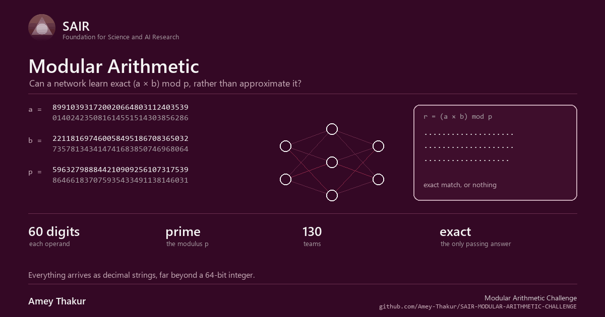
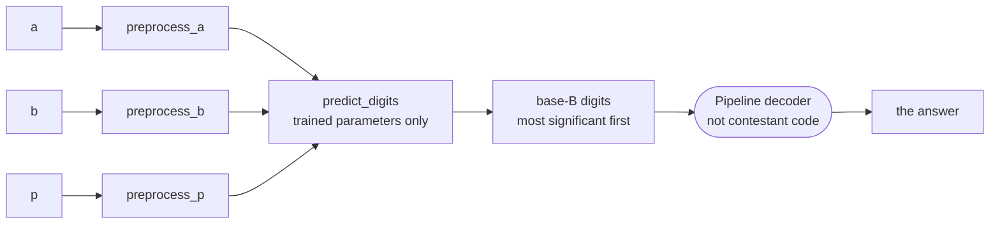
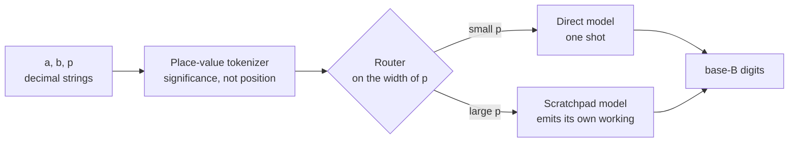

<div align="center">

<a href="https://competition.sair.foundation/competitions/modular-arithmetic-challenge/overview" title="SAIR Foundation, open the competition"></a>

# Modular Arithmetic Challenge

**Can a neural network learn exact arithmetic, rather than approximate it?**

<br>

Given two integers hundreds of digits long and a prime, return `(a × b) mod p`
exactly, with no arithmetic written into the code that runs. Everything here is
the laboratory that question was worked in, and the model it produced.

<br>

[Documentation](docs/README.md) &nbsp;·&nbsp;
[Laboratory](src/README.md) &nbsp;·&nbsp;
[Model](https://huggingface.co/ameythakur/SAIR-Modular-Arithmetic-Challenge) &nbsp;·&nbsp;
[Competition](https://competition.sair.foundation/competitions/modular-arithmetic-challenge/overview) &nbsp;·&nbsp;
[Discussions](https://github.com/Amey-Thakur/SAIR-MODULAR-ARITHMETIC-CHALLENGE/discussions)

<br>

[](https://competition.sair.foundation/competitions/modular-arithmetic-challenge/overview)
[](https://competition.sair.foundation/competitions/modular-arithmetic-challenge/overview)
[](https://pytorch.org/)
[](https://huggingface.co/ameythakur/SAIR-Modular-Arithmetic-Challenge)
[](LICENSE)

<br>



</div>

---

<br>

## The problem

Give a calculator two numbers and a prime and it returns the remainder without
thinking. Give the same job to a neural network and it becomes an open research
question.

> Compute `(a × b) mod p`, where `a` and `b` run to about 1,233 decimal digits,
> `p` is prime and up to about 617 digits, and `a` and `b` may be far larger
> than `p`.

Everything arrives as decimal strings, and the answer is scored on exact match,
because a remainder that is off by one is simply wrong.

Organised by **Alberto Alfarano**, **François Charton**, **Yongzheng Jia**,
**Kristin Lauter**, **Cathy Li**, **Terence Tao** and **Emily Wenger**, and run
from 8 June to 12 August 2026.

<br>

## Why it is hard

Small transformers can already learn modular *addition* for small primes, and
the representations they find inside look like Fourier analysis on a cyclic
group. Multiplication is a different problem.

| Difficulty | Why it bites |
| :--- | :--- |
| **Carrying** | Couples digits that sit far apart in the input |
| **Coordination** | Has to hold across many digits, at every scale |
| **Growing output** | The answer length follows the input length, so nothing is fixed width |
| **Reduction** | Then sits on top of all of it |

There is also a structural obstacle that has nothing to do with arithmetic.

> [!IMPORTANT]
> A transformer told **where** a digit sits counts from the left, so padding an
> operand moves every digit it has ever seen. A model trained on short operands
> has never encountered index 7. Told instead what a digit is **worth**, it has
> seen significance 3 on every example it was ever given.
>
> Place value is not a trick for this task. It is the only description of a
> digit that survives the thing the task does to inputs.

<br>

## What was submitted, and the line that must not be crossed

A submission is a **public Hugging Face repository**, identified by `repo_id`
and an immutable `commit_hash`. Organisers run the official evaluation against
a secret random seed.

The interface is shaped so the obvious shortcuts are structurally impossible.



Each hook sees **only its own argument**, so no single point in the submitted
code ever holds `a`, `b` and `p` together. The base B is declared in
`manifest.json` as any integer in `[2, 2^32]`, or the string `"p"`. The decoder
belongs to the pipeline, so there is no post-processing step to write.

> [!CAUTION]
> The principle is one sentence: the model must **learn** to compute the
> answer, and may not delegate, look up, or hard-code it.
>
> Disqualifying at inference time: computing the result with `sympy`, `gmpy2`,
> `mpmath`, `flint` or Python big integers on the original arguments; lookup
> tables keyed on the inputs or their hashes; `eval`, `exec`, `compile`,
> `__import__`, `ctypes`; network access; reading outside the submission
> directory; subprocesses; and any leakage between the three preprocessing
> hooks.

> [!TIP]
> Explicitly allowed, and worth knowing: base conversion and small-value
> modular arithmetic inside a single hook, any internal representation at all,
> and a loop that feeds the model its own tokens one at a time, so long as the
> encoder gets no feedback from the model about what to feed next.

<br>

## The four bets



**Abacus significance embeddings.** Drop absolute coordinates and inject place
value instead, so a digit is described by what it is worth rather than where it
sits. A 1,024-bit prime then travels the same path as a 16-bit one.

**Algorithmic scratchpads.** Force the model to emit its intermediate working,
which turns a fixed-depth network into a recurrent state machine and lets it
spend computation in proportion to the size of the number rather than in
proportion to its own depth.

**Grokking.** Train far past the point where validation loss has flattened,
with heavy weight decay, so memorised circuits collapse into the sparse
algorithm underneath. The published weights were taken after that transition.

**Routing.** Small and large moduli want different amounts of computation, so a
light router reads the width of `p` and dispatches accordingly.

<br>

## The published model

**[ameythakur/SAIR-Modular-Arithmetic-Challenge](https://huggingface.co/ameythakur/SAIR-Modular-Arithmetic-Challenge)**

`.safetensors` weights, a character-level place-value tokenizer, and a custom
`handler.py` so the Hugging Face Inference API can serve it directly.

<br>

## What is where

| Path | What it holds |
| :--- | :--- |
| **[docs/](docs/README.md)** | The reading order: design, competition analysis, literature, open questions |
| **[src/](src/README.md)** | The laboratory: architectures, data generation, training, evaluation, sandbox, export |
| [src/architectures/](src/architectures/) | Abacus and algorithmic models, plain and RoPE baselines, the hybrid router |
| [src/datasets/](src/datasets/) | Prime, curriculum and scratchpad generators, and the [dataset roadmap](src/datasets/dataset_roadmap.md) |
| [src/sandbox/](src/sandbox/) | An AST validator and a judge simulator, so the rules are checked before packaging |
| [src/huggingface/](src/huggingface/README.md) | Export to `.safetensors`, the inference handler, and the model card |
| [data/](data/) | Sample curriculum and scratchpad shards |

<br>

## Reproduce it

Python 3.10 or newer and PyTorch 2.0 or newer.

```bash
python src/datasets/generators/prime_gen.py
python src/datasets/generators/dataset_gen.py
python src/training/train.py
python src/evaluation/eval.py
```

Then, before anything is packaged:

```bash
python src/sandbox/ast_validator.py
python src/sandbox/simulate_judge.py
```

<br>

## Reading further

- [Official repository](https://github.com/SAIRcompetition/modular-arithmetic-challenge), pipeline, test generator and reference models
- [Power et al.](https://arxiv.org/abs/2201.02177), grokking beyond overfitting on small algorithmic datasets
- [McLeish et al.](https://arxiv.org/abs/2405.17399), abacus embeddings and length generalisation in arithmetic

<br>

---

<div align="center">

### SAIR Foundation competitions

| Repository | Challenge |
| :--- | :--- |
| [SAIR-MODULAR-ARITHMETIC-CHALLENGE](https://github.com/Amey-Thakur/SAIR-MODULAR-ARITHMETIC-CHALLENGE) | Exact modular multiplication by neural induction |
| [SAIR-INVERSE-GALOIS-PROBLEM-IGP24](https://github.com/Amey-Thakur/SAIR-INVERSE-GALOIS-PROBLEM-IGP24) | Inverse Galois Problem in degree 24 |
| [SAIR-MATHEMATICS-DISTILLATION-CHALLENGE](https://github.com/Amey-Thakur/SAIR-MATHEMATICS-DISTILLATION-CHALLENGE) | Equational Theories, Stage 1 and Stage 2 |

<br>

Prepared by **[Amey Thakur](https://github.com/Amey-Thakur)** &nbsp;·&nbsp;
ORCID [0000-0001-5644-1575](https://orcid.org/0000-0001-5644-1575)

<sub>Released under <a href="LICENSE">CC BY 4.0</a>, with citation metadata in <a href="CITATION.cff">CITATION.cff</a>.</sub>

</div>
