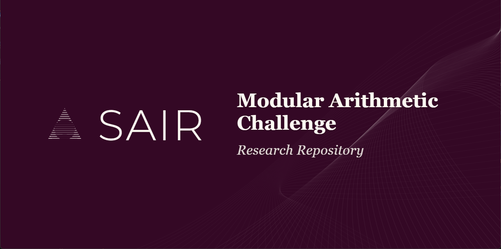

# SAIR Modular Arithmetic Challenge

**Prepared by**: [Amey Thakur](https://github.com/Amey-Thakur)

Repository for the **SAIR Modular Arithmetic Challenge**. A laboratory testing neural network induction of exact arithmetic logic, specifically modular multiplication `(a × b) mod p`, isolated from external symbolic modules or arbitrary precision math libraries.

> **Related Challenge**: [SAIR-MATHEMATICS-DISTILLATION-CHALLENGE](https://github.com/Amey-Thakur/SAIR-MATHEMATICS-DISTILLATION-CHALLENGE)

---

## Research Scope

Standard transformers fail at exact arithmetic due to position and scale permutation. We test:
1. **Grokking**: Validation loss phase transitions over delayed gradient steps.
2. **Abacus Embeddings**: Eliminating absolute spatial coordinates in favor of mathematical place-value significance to achieve perfect length generalization.
3. **Algorithmic Emulation**: Forcing multi-layer state machines via autoregressive trace decoding (Scratchpads).
4. **Dynamic Routing**: Mixture of Experts (MoE) dispatch logic bridging small and large modulo tiers.

## Pre-trained Models (Hugging Face)

The weights derived from this research have been serialized and deployed to the Hugging Face Model Hub. The model uses Abacus Embeddings to execute bit-serial algorithmic reasoning organically.

**🤗 Model Repository**: [SAIR-Modular-Arithmetic-Challenge](https://huggingface.co/ameythakur/SAIR-Modular-Arithmetic-Challenge)

- **Weights Format**: `.safetensors`
- **Inference Integration**: Includes a custom `handler.py` for direct compatibility with the Hugging Face Inference API.

---

## Directory Architecture

*   **[`docs/`](./docs/)**: Theoretical constraints, literature reviews, and publications.
*   **[`src/architectures/`](./src/architectures/)**: PyTorch module definitions (Abacus, RoPE Transformers, Routers).
*   **[`src/datasets/`](./src/datasets/)**: Curriculum and prime data generation pipelines.
*   **[`src/tokenization/`](./src/tokenization/)**: Custom significance-aware tokenization protocols.
*   **[`src/training/`](./src/training/)**: Execution loops, loss functions, and dataset wrappers.
*   **[`src/evaluation/`](./src/evaluation/)**: Exact-match inference metrics.
*   **[`src/sandbox/`](./src/sandbox/)**: AST validation simulating the strict SAIR sandbox contract.
*   **[`src/submission/`](./src/submission/)**: Isolated predict.py inference targets.
*   **[`src/huggingface/`](./src/huggingface/)**: Export and SafeTensors serialization scripts.

---

## Development Workflow

1. **Generation**: Execute `src/datasets/generators/` for specific bit-width curriculums.
2. **Execution**: Run `src/training/train.py` to compile checkpoints.
3. **Validation**: Test AST boundaries via `src/sandbox/ast_validator.py` and `simulate_judge.py`.
4. **Serialization**: Convert binaries via `src/huggingface/scripts/convert_to_safetensors.py`.

---

## Acknowledgements

- **SAIR**: Challenge infrastructure.
- **Power et al.**: Grokking foundations.
- **McLeish et al.**: Abacus Embeddings logic.
