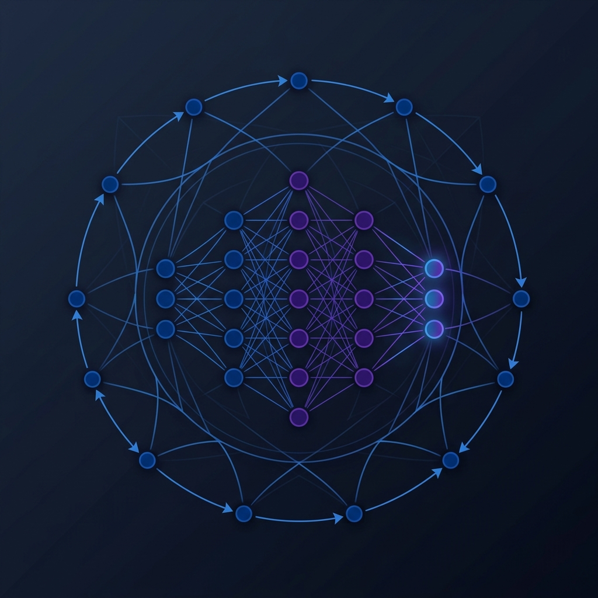

# SAIR Modular Arithmetic Challenge

**Prepared by**: [Amey Thakur](https://github.com/Amey-Thakur)

Welcome to the long-term research repository for the **SAIR Modular Arithmetic Challenge**. This repository acts as a comprehensive laboratory for investigating how neural networks can organically learn mathematically rigid operations like modular multiplication ($(a \times b) \pmod{p}$) without relying on hard-coded symbolic logic.

---

## Repository Purpose & Research Goals

This repository is **NOT** just a code dump; it is a structured research environment. Our core objective is to bypass the "learnability wall" where standard transformers fail at arithmetic logic.

We are specifically investigating:
1. **Grokking**: Phase transitions in validation loss during prolonged training.
2. **Algorithmic Emulation**: Teaching models to act as state machines by generating autoregressive "scratchpads" (e.g., Horner's method).
3. **Representation Learning**: Analyzing the impact of Base-10 vs. Base-2 vs. Base-256 tokenization on sequence length generalization.
4. **Dynamic Routing**: Building experts that can adaptively solve 16-bit primes vs 1024-bit primes based on computational budget.

---

## Directory Architecture

The repository is modularized around the machine learning lifecycle: theory, data, design, execution, validation, and publication.

*   **[`docs/`](./docs/)**: Core architectural decisions and documentation root.
*   **[`competition/`](./competition/)**: Strict rules, sandbox constraints, and leaderboard strategies.
*   **[`research/`](./research/) & [`literature/`](./literature/)**: Theoretical knowledge base and paper summaries.
*   **[`planning/`](./planning/)**: Strategic roadmaps for experiments and modeling.
*   **[`datasets/`](./datasets/)**: Synthetic data generators for large prime arithmetic.
*   **[`architectures/`](./architectures/)**: Neural network definitions (e.g., standard transformers, ALiBi, routers).
*   **[`tokenization/`](./tokenization/)**: Digit, byte, and bit-level string processing.
*   **[`training/`](./training/) & [`experiments/`](./experiments/)**: Loop implementations, configs, and isolated trial archives.
*   **[`evaluation_pipeline/`](./evaluation_pipeline/) & [`sandbox/`](./sandbox/)**: Local mock of the strict SAIR judge (AST behavioral checks).
*   **[`submission/`](./submission/)**: Artifacts formatted explicitly for the competition constraints.
*   **[`huggingface/`](./huggingface/)**: Placeholders and model cards for final community release.
*   **[`branding/`](./branding/)**: Visual identity, SVGs, and diagram resources.

---

## Reading Order

To understand this project, we recommend following the [Documentation Reading Guide](./docs/README.md), which sequences the theoretical foundations before diving into the roadmaps.

*If you are looking for how to run the code, please note this repository is currently in the **Planning Phase**. Implementation of the PyTorch architectures is pending.*

---

## Model Development Workflow

1. **Formulate Hypothesis**: Logged in [`planning/experiment_roadmap.md`](./planning/experiment_roadmap.md).
2. **Generate Data**: Use `datasets/generators/` to create the appropriate curriculum.
3. **Train & Ablate**: Run isolated trials in `experiments/active/`.
4. **Evaluate Locally**: Pass the model through `sandbox/simulate_judge.py` to ensure it adheres to the strict inference contract (no `%` operators allowed).
5. **Publish**: Prepare weights via `submission/` and document on the `huggingface/` hub.

---

## Contribution Guide

This is an active research hub. 
- All experiments must be accompanied by loss curve logs and an explicit configuration.
- Do not commit directly to `main`. Create feature branches (`feat/char-tokenizer`, `exp/alibi-ablation`).
- Follow the Markdown-first philosophy: document the math before writing the PyTorch code.

## Acknowledgements
- **SAIR**: For hosting the Modular Arithmetic Challenge.
- **Power et al. (OpenAI)**: For the foundational work on Grokking.
- **Nanda et al.**: For mechanistic interpretability of modular addition.

---
*Built with rigor, designed for discovery.*
