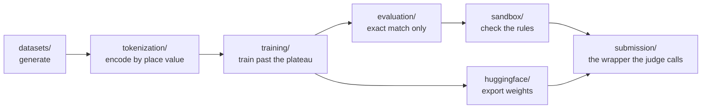

<div align="center">

# The laboratory

**Where the four bets are actually implemented.**

[Back to the repository](../README.md) &nbsp;·&nbsp;
[Documentation](../docs/README.md) &nbsp;·&nbsp;
[Model](https://huggingface.co/ameythakur/SAIR-Modular-Arithmetic-Challenge)

</div>

---

Each directory owns one stage and knows nothing about the others. A model does
not know how its data was generated, the tokenizer does not know which model
will consume it, and the sandbox check does not know what it is checking.



## What each directory does

| Directory | Contents | Why it exists |
| --- | --- | --- |
| [architectures/](architectures/) | [abacus](architectures/abacus/abacus_model.py), [algorithmic](architectures/algorithmic/algorithmic_model.py), [baselines](architectures/baselines/) with plain and RoPE transformers, [router](architectures/router/hybrid_router.py) | Every architectural bet is a separate model, so they can be compared rather than argued about |
| [datasets/](datasets/) | [prime_gen](datasets/generators/prime_gen.py), [dataset_gen](datasets/generators/dataset_gen.py), [scratchpad_gen](datasets/generators/scratchpad_gen.py), [roadmap](datasets/dataset_roadmap.md) | Native big-integer arithmetic is allowed here and nowhere near inference. This is where that line sits |
| [tokenization/](tokenization/) | [base10_tokenizer](tokenization/base10_tokenizer.py) | Digits carry significance rather than position. The whole length-generalisation argument lives in this one file |
| [training/](training/) | [train](training/train.py), [dataset](training/dataset.py) | Long schedules with heavy weight decay, because grokking happens well after validation loss has stopped moving |
| [evaluation/](evaluation/) | [eval](evaluation/eval.py) | Exact match, and nothing else. A remainder that is off by one is wrong |
| [sandbox/](sandbox/) | [ast_validator](sandbox/ast_validator.py), [simulate_judge](sandbox/simulate_judge.py) | Reads the submission's syntax tree for banned arithmetic, and rehearses the judge locally |
| [submission/](submission/) | [predict](submission/predict.py), [roadmap](submission/submission_roadmap.md) | The only code the evaluator calls |
| [huggingface/](huggingface/README.md) | [convert_to_safetensors](huggingface/scripts/convert_to_safetensors.py), [handler](huggingface/handler.py), [integration plan](huggingface/integration_plan.md) | A submission is a public Hugging Face repository, so export is part of the pipeline rather than an afterthought |

## The rule that shapes everything

Native arithmetic is allowed while generating data and while training. It is
forbidden at inference.

That is why `datasets/` may compute `(a * b) % p` freely and `submission/`
may not compute it at all. The separation is not stylistic. Static analysis
reads the submitted syntax tree, and a wrapper that quietly recombines the
three preprocessing arguments and reduces them in Python is disqualified
rather than marked down.

## Order of work

```bash
python datasets/generators/prime_gen.py
python datasets/generators/dataset_gen.py
python datasets/generators/scratchpad_gen.py
python training/train.py
python evaluation/eval.py
python huggingface/scripts/convert_to_safetensors.py
```

Then, before anything is packaged:

```bash
python sandbox/ast_validator.py
python sandbox/simulate_judge.py
```

> [!NOTE]
> [`submission/predict.py`](submission/predict.py) was written against the
> interface as first published, which took an equation string and returned an
> answer string. The official contract later settled on three per-argument
> preprocessing hooks and a `predict_digits` call returning base-B digits, with
> `manifest.json` declaring the base. The [root README](../README.md) carries
> the final shape. The submitted artefact is the published model, not this
> wrapper.

**[Back to the repository](../README.md)** &nbsp;·&nbsp;
**[Read the documentation](../docs/README.md)**
